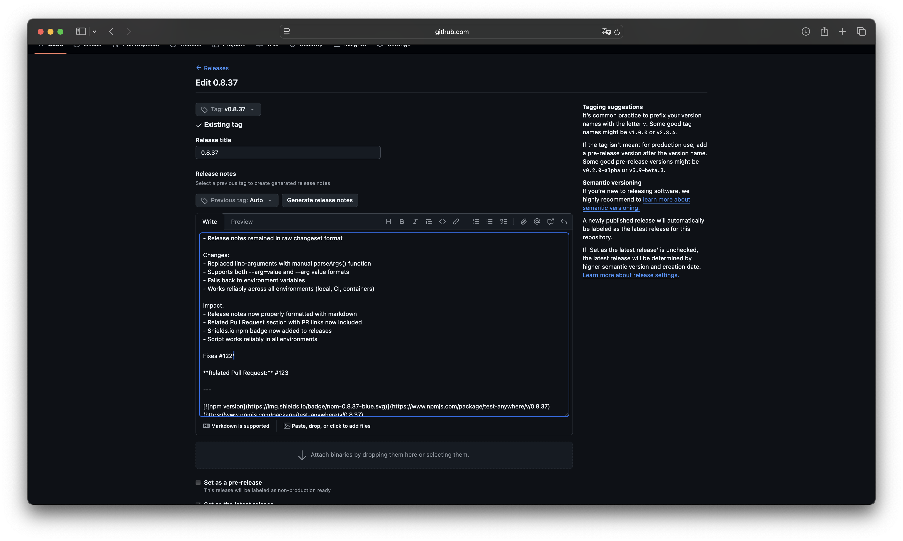

# Case Study: Issue #124 - Strange Single Quote at End of Markdown Release Notes

## Issue Summary

**Issue:** https://github.com/link-foundation/test-anywhere/issues/124
**Reported by:** @konard
**Date Discovered:** 2025-12-11
**Affected Release:** v0.8.37
**Symptom:** A stray single quote (`'`) appears at the very end of formatted release notes on GitHub

## Visual Evidence



The release notes show:

```markdown
[](https://www.npmjs.com/package/test-anywhere/v/0.8.37) (https://www.npmjs.com/package/test-anywhere/v/0.8.37)'
```

Note the trailing `'` at the very end.

## Timeline of Events

### Initial Release Creation (2025-12-11 13:20:27Z)

1. **Changeset Processing**
   - PR #123 was merged to main branch
   - Changeset content: "fix: replace lino-arguments in format-release-notes.mjs for reliable CI execution"
   - Version bumped to 0.8.37 in package.json

2. **GitHub Release Creation (2025-12-11 13:20:37Z)**
   - Script: `scripts/create-github-release.mjs`
   - Tag created: `v0.8.37`
   - Release notes extracted from CHANGELOG.md
   - **Critical Detail:** The command-stream library wrapped the notes with BOTH double quotes AND single quotes:
     ```bash
     gh release create "v0.8.37" --title "0.8.37" --notes "'### Patch Changes...Fixes #122'"
     ```
   - This caused the release notes to be created with a leading `'` and trailing `'`

3. **Release Notes Formatting (2025-12-11 13:20:42Z)**
   - Script: `scripts/format-release-notes.mjs`
   - The script extracts patch changes from the release body
   - Cleans up the description (removes `\n`, excessive whitespace, etc.)
   - Adds "Related Pull Request" link
   - Adds npm badge
   - **The Bug:** The cleanup regex doesn't remove the trailing single quote from the original notes

### Sequence Diagram

```
create-github-release.mjs
    |
    ├─> Read CHANGELOG.md
    ├─> Extract version 0.8.37 notes
    ├─> Escape double quotes in notes
    ├─> Build command with command-stream $`...`
    |       |
    |       └─> command-stream adds protective single quotes
    |           Result: --notes "'### Patch Changes...'"
    |
    └─> gh release create (creates release with leading/trailing ')

format-release-notes.mjs
    |
    ├─> Fetch release via GitHub API
    ├─> Extract rawDescription from patch changes
    |       "### Patch Changes\n\n- 715382c: ...Fixes #122'"
    |                                                      ^ trailing quote
    ├─> Clean description
    |   ├─> Replace \\n with \n
    |   ├─> Remove 📦 badge lines
    |   ├─> Remove --- separators
    |   ├─> Trim whitespace
    |   └─> ❌ BUG: Doesn't remove trailing '
    |
    ├─> Add PR link
    ├─> Add npm badge and URL
    |       Result: "...badge](url) (url)'"
    |                                   ^ still there!
    └─> Update release body
```

## Root Cause Analysis

### Primary Cause: Missing Quote Cleanup in format-release-notes.mjs

The `cleanDescription` logic in `format-release-notes.mjs` (lines 119-127) performs several cleanup operations:

```javascript
const cleanDescription = rawDescription
  .replace(/\\n/g, '\n') // Convert escaped \n to actual newlines
  .replace(/📦.*$/s, '') // Remove any existing npm package info
  .replace(/---.*$/s, '') // Remove any existing separators and everything after
  .trim() // Trim whitespace from each line
  .split('\n')
  .map((line) => line.trim())
  .join('\n')
  .replace(/\n{3,}/g, '\n\n'); // Normalize excessive blank lines
```

**The Missing Step:** There's no cleanup for the leading/trailing single quotes that were added by the command-stream library during release creation.

### Contributing Factor: command-stream's Quote Wrapping Behavior

The `command-stream` library, when building shell commands with template literals, adds protective single quotes inside double quotes to handle special characters safely. This is visible in the CI logs:

```
[Utils] buildShellCommand EXIT | {
  "command": "gh release create \"v0.8.37\" --title \"0.8.37\" --notes \"'### Patch Changes...'"
}
```

The library wraps the notes content with single quotes (`'...'`) inside the double quotes for shell safety.

### Why This Wasn't Caught Earlier

1. **Recent Introduction:** This bug was introduced in the same release cycle where `lino-arguments` was replaced with manual argument parsing (PR #122/123)
2. **Format-then-Create Pattern Changed:** Earlier releases may have had different formatting patterns
3. **Testing Gap:** No automated tests verify the exact format of the final release notes, especially edge cases with special characters

## Online Research

### Similar Issues Found

1. **Shell Quoting Issues with GitHub CLI**
   - Common pattern: nested quotes in shell commands cause unexpected quote characters in output
   - GitHub CLI's `--notes` flag is sensitive to quote escaping
   - Recommendation: Use `--notes-file` or `--input` with stdin instead of inline strings

2. **command-stream Library Behavior**
   - The library's shell command builder automatically adds protective quoting
   - This is documented behavior for handling special characters
   - Users should be aware of quote nesting when using template literals

3. **Markdown Special Characters**
   - Single quotes are valid markdown and don't cause rendering issues
   - However, they break the visual consistency of formatted documents
   - Best practice: Strip all non-markdown special characters after extraction

## Proposed Solutions

### Solution 1: Add Quote Cleanup to format-release-notes.mjs (RECOMMENDED)

**Approach:** Add a cleanup step to remove leading/trailing single quotes from the extracted description.

**Changes:**

```javascript
const cleanDescription = rawDescription
  .replace(/\\n/g, '\n')
  .replace(/^['"]|['"]$/g, '') // ← NEW: Remove leading/trailing quotes
  .replace(/📦.*$/s, '')
  .replace(/---.*$/s, '')
  .trim();
// ... rest of cleanup
```

**Pros:**

- Minimal change (one line)
- Defensive coding - handles quotes from any source
- Fixes the current issue and prevents future occurrences
- No breaking changes to other scripts

**Cons:**

- Doesn't address the root cause (command-stream quoting)
- Could potentially remove legitimate quotes (very unlikely)

### Solution 2: Use --notes-file Instead of Inline --notes

**Approach:** Modify create-github-release.mjs to write notes to a temp file and use `--notes-file` flag.

**Changes:**

```javascript
import { writeFileSync, unlinkSync } from 'fs';
import { tmpdir } from 'os';
import { join } from 'path';

const notesFile = join(tmpdir(), `release-notes-${tag}.txt`);
writeFileSync(notesFile, releaseNotes, 'utf8');

try {
  await $`gh release create "${tag}" --title "${version}" --notes-file "${notesFile}" --repo "${repository}"`;
} finally {
  unlinkSync(notesFile);
}
```

**Pros:**

- Avoids all quote escaping issues
- More robust for large/complex release notes
- Recommended by GitHub CLI documentation

**Cons:**

- More complex code
- Requires file I/O and cleanup
- Doesn't fix releases already created

### Solution 3: Use stdin with --input Flag

**Approach:** Pipe the notes content via stdin instead of command-line argument.

**Changes:**

```javascript
const updatePayload = JSON.stringify({ body: releaseNotes });
await $`gh release create "${tag}" --title "${version}" --notes - --repo "${repository}"`.run(
  {
    stdin: releaseNotes,
  }
);
```

**Pros:**

- Avoids shell quoting entirely
- Clean and simple
- Already used in format-release-notes.mjs for updates

**Cons:**

- Different API pattern
- May require adjustments to command-stream usage

## Recommended Solution

**Implement Solution 1 immediately** as it:

1. Fixes the bug with minimal code change
2. Acts as defensive coding for future edge cases
3. Can be deployed and tested quickly
4. Doesn't break existing workflows

**Consider Solution 2 or 3 for future improvement** to eliminate the root cause and make the system more robust.

## Implementation Plan

1. ✅ Document the issue thoroughly (this document)
2. ⏳ Implement Solution 1: Add quote cleanup regex
3. ⏳ Create experiment script to test the fix
4. ⏳ Run local CI checks
5. ⏳ Commit and push to PR
6. ⏳ Verify fix in next release

## Testing Strategy

### Manual Testing

1. Create experiment script that simulates the exact scenario
2. Test with various input formats:
   - Notes with leading/trailing single quotes
   - Notes with double quotes
   - Notes with both
   - Notes with escaped characters
   - Notes with special markdown

### Regression Prevention

1. Add unit test for `cleanDescription` logic
2. Consider adding end-to-end test that creates a release and verifies formatting

## Lessons Learned

1. **Shell Quoting is Complex:** When using shell command builders, be aware of automatic quote wrapping
2. **Defensive Cleanup:** Always sanitize extracted content, even from trusted sources
3. **Test Edge Cases:** Special characters and quoting edge cases should be part of test suites
4. **Documentation Matters:** Library behaviors (like command-stream's quote wrapping) should be well understood

## References

- Issue: https://github.com/link-foundation/test-anywhere/issues/124
- Affected Release: https://github.com/link-foundation/test-anywhere/releases/tag/v0.8.37
- Related PR #123: https://github.com/link-foundation/test-anywhere/pull/123
- CI Logs: ./ci-logs-20134467350.log
- Screenshot: ./screenshot.png
